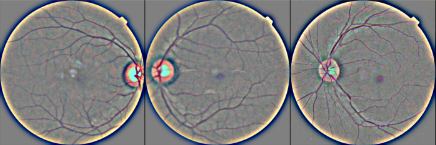

# ViT-CAMNet-Model

# Detection and Multilevel Classification of Diabetic Retinopathy 

## About

Diabetic Retinopathy (DR) is a common complication of diabetes mellitus, which causes lesions on the retina that effect vision. If it is not detected early, it can lead to blindness. In this project, I use tensorflow to develop neural networks which can detect diabetic retinopathy from retinal images. 

## Data (Link of Dataset is given below)

The dataset is obtained from a ([Diabetic Retinopathy Dataset)](https://www.kaggle.com/datasets/sachinkumar413/diabetic-retinopathy-dataset). This dataset consists of images categorized into five classes, labeled 0 to 4, with each label representing a progressive increase in disease severity: 0 Healthy, 1- Mild DR, 2- Moderate DR, 3- Proliferative DR, and 4- Severe DR. Each image has dimensions of 256×256 pixels, and the dataset contains a total of 2,750 images. However, the dataset is highly imbalanced, with the class distribution as follows: 1,000 Healthy, 370 Mild, 900 Moderate, 290 Proliferative, and 190 Severe DR images.

## Random Oversampling (Refer Data Preprocessing DR Dataset.txt file)

It is used to equlaize te number of images in different classes of DR.

# Dataset Splitting

The data is divided into training set (80%) and test/validation sets (20%). Then test/validation set is further split into validation (10%) and test (10%) sets. 

## Data Preprocessing & Augmentation (Refer Data Preprocessing DR Dataset.txt file)

The preprocessing pipeline consists of the following:
1. Resizing
2. Normalization
3. ZCA (Zero Component Analysis) Whitening

## Fine Tuned Vision Transformer (Refer Vision Transformer.txt file)

The Vision Transformer (ViT) model adapts the transformer architecture from the field of natural language processing (NLP) to image recognition tasks. Transformers initially transformed natural language processing (NLP) by allowing models to capture long-range dependencies and context within text. Drawing inspiration from this success, researchers have begun applying transformers to computer vision, aiming
 to potentially supplant convolutional neural networks (CNNs). ViT has three variants,  namely Base, Large and Huge. We applied fine-tuned vit base patch32 224 to perform multi-classification of DR. The specific variant vit base patch32 224 is used for multi level classification of DR.
 
## Training and Evaluation (Refer Multi Level Classification of DR.txt) 

Then fine tuned variant vit base patch32 224 is trained and evaluated.

## Highlighting Potential Parts of Image

## Dataset (Link of Dataset is given below)

The next dataset is used named ([APTOS2019 )] (https://www.kaggle.com/datasets/mariaherrerot/aptos2019).

## Random Oversampling (Refer Data Preprocessing Aptos2019 Dataset.txt file)

Random oversampling to equal the number of images present in different classes. 

## Results

The current models return the following scores for binary classification (DR vs No DR) on the dataset.
| Model | Accuracy |
| :-----: | :-----: |
| Standard CNN (Training) | 82.2% |
| Standard CNN (Validation) | 82.2% |
| InceptionV3 (Training) | 86.0% |
| InceptionV3 (Validation) | 85.8% |
