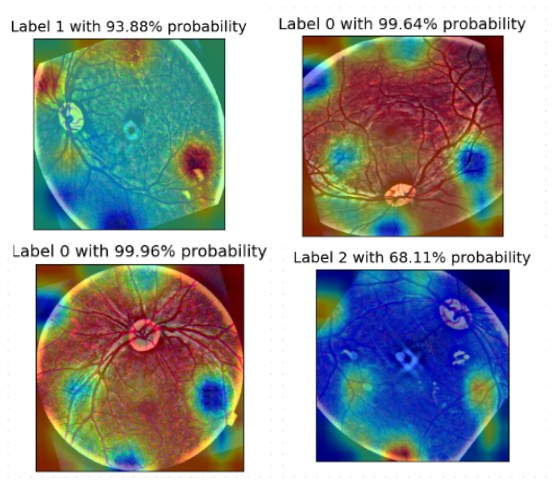

# USAGE GUIDELINES
# Detection and Multilevel Classification of DR with highlighting the Image Regions contributing to Prediction results along with their Probability Values

## About

Diabetic retinopathy (DR) is a leading problem throughout the world and many people are losing their vision because of this disease. It is a common complication of diabetes mellitus, which causes lesions on the retina that effect vision. If it is not detected early, it can lead to blindness. 

# Proposed ViT-CAMNet-Model

The integration of ViT for feature extraction, customized training of InceptionV3, and the use of Grad-CAM for interpretability, along with robust preprocessing and fine-tuning techniques, collectively contribute to a highly effective and interpretable ViT-CAMNet model for the classification and diagnosis of Diabetic Retinopathy.

# Detection and Multilevel Classification of Diabetic Retinopathy

## Data (Link of Dataset is given below)

The dataset is obtained from a ([Diabetic Retinopathy Dataset)](https://www.kaggle.com/datasets/sachinkumar413/diabetic-retinopathy-dataset). It contains 2,750 images across five classes, labeled from 0 (Healthy) to 4 (Severe DR), with the following distribution:

0: Healthy - 1000 images,
1: Mild DR - 370 images,
2: Moderate DR - 900 images,
3: Proliferative DR - 290 images,
4: Severe DR - 190 images.

## Random Oversampling (Refer Data Preprocessing DR Dataset.txt file)

It is used to equalize the number of images in different classes of DR.

## Dataset Splitting

The data is divided into training set (80%) and test/validation sets (20%). Then test/validation set is further split into validation (10%) and test (10%) sets. 

## Data Preprocessing & Augmentation (Refer Data Preprocessing DR Dataset.txt file)

The preprocessing pipeline consists of the following:
1. Resizing
2. Normalization
3. ZCA (Zero Component Analysis) Whitening

## Fine Tuned Vision Transformer (Refer Vision Transformer.txt file)

The Vision Transformer (ViT) model adapts the transformer architecture from the field of natural language processing (NLP) to image recognition tasks. Transformers initially transformed NLP by allowing models to capture long-range dependencies and context within text. Drawing inspiration from this success, researchers have begun applying transformers to computer vision, aiming to potentially supplant convolutional neural networks (CNNs). ViT has three variants,  namely Base, Large and Huge. We applied fine-tuned vit base patch32 224 to perform multi-classification of DR. The specific variant vit base patch32 224 is used for multi level classification of DR.
 
## Training and Evaluation (Refer Multi Level Classification of DR.txt file) 

Then fine tuned variant vit base patch32 224 is trained and evaluated.

## DR Predictions  (Refer Predictions of DR Class.txt file) 

# Highlighting Potential Parts of Image

## Dataset (Link of Dataset is given below)

The next dataset is used named ([APTOS2019)](https://www.kaggle.com/datasets/mariaherrerot/aptos2019). It contains separate folders for training and testing images.

## Data Preprocessing (Refer Data Preprocessing Aptos2019 Dataset.txt file)

The preprocessing pipeline consists of the following:
1. Random oversampling
2. BGR to RGB
3. Cropping
4. Resizing
5. Gaussian blur
6. Flipping
7. Rotation
8. Normalization

## InceptionV3 Training (Refer InceptionV3.txt file)

The Inception v3 is loaded from the path linception v3 google-1a9a5a14.pth. The auxiliary logits layer is removed from the loaded state dictionary, and the fully connected layer is modified to match the count of classes. The modified state dictionary is then loaded into the model. Additionally, the pretrained weights are removed, and the model is initialized with custom weights. Removing the auxiliary logits layer from
the loaded state dictionary improves the efficiency, speed, and simplicity of the model during inference without compromising its performance.

## Test time Augmentation (Refer Test time Augmentation.txt file)

Test Time Augmentation (TTA) involves applying various transformations to test images to enhance inceptionV3 predictions.

## Gradient-weighted Class Activation Mapping (Refer GRADCAM.txt file)

GRADCAM provides an interpretable visual explanation of the network’s decision by highlighting the image areas that influenced the prediction the most. The Label indicates the predicted class and the probabilities associated with each label represent the network’s confidence level in its classification.

# Results

The current models return the following scores for binary classification (DR vs No DR) on the dataset.
| ViT-CAMNet Model| Accuracy |
| :-----: | :-----: |
| Training | 98.3% |
|  ViT-CAMNet Mode(Validation) | 94.4% |
|  ViT-CAMNet Mode (Testing) | 93% |

## Conclusions

The proposed ViT-CAMNet Model shows strong performance in multilevel classification of Diabetic Retinopathy. The use of Grad-CAM provides visual interpretability, allowing for more trust in the model's predictions, which is especially valuable in a medical setting.
